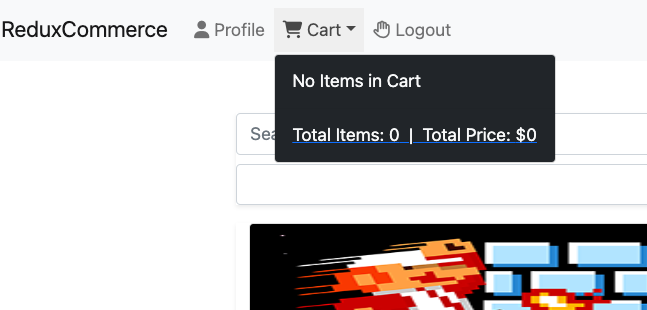
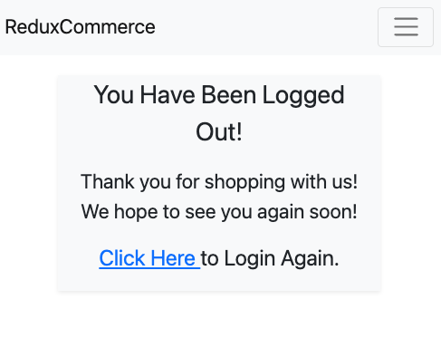

# ReduxCommerce
- A mock up full featured, full-stack application.

## App Overview:

        
        
        
        
        
        
        
***       

## App Features:
- Full Create, Read, Update, Delete functionality
- JWT Authentication
- UUID Alert Messages
- Stripe Payments
- AES Encrypted Protection for Payment Options

### Tech Used:
- HTML
- CSS
    * Bootstrap5
- JavaScript
    * React
    * Redux-Thunk
- Python
    * Django
    * Django REST
    * SQLite
    * Pillow

#### My Links:
[Twitter](https://www.twitter.com/ManicNeo142)
[LinkedIn](https://www.linkedin.com/in/markharmon142)
[Email](mharmondev1503@gmail.com)
